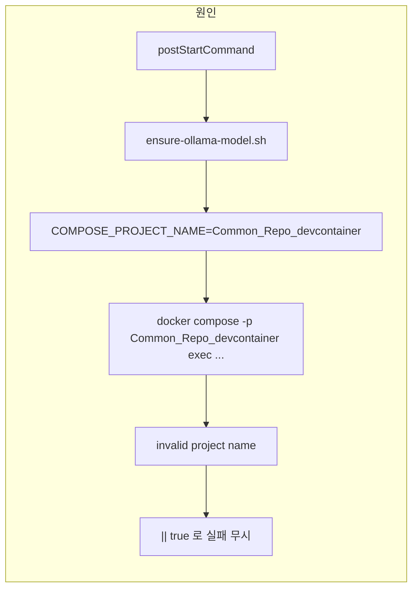

# Ollama 모델 미설치 원인 수정 및 doc/스크립트 정리

## 1. 원인 분석

**근본 원인**: `[.devcontainer/scripts/ensure-ollama-model.sh](.devcontainer/scripts/ensure-ollama-model.sh)` 9번 줄에서 `COMPOSE_PROJECT_NAME`을 디렉터리 basename으로 설정할 때 **대문자가 그대로 사용**됨.

- devcontainer 내부 `pwd` → `/workspaces/Common_Repo`
- `basename` → `Common_Repo` → `COMPOSE_PROJECT_NAME="Common_Repo_devcontainer"`
- Docker Compose `-p`(project name) 규칙: **소문자, 숫자, 하이픈, 언더스코어만 허용**
- 따라서 `docker compose ... -p Common_Repo_devcontainer exec ...` 실행 시 **"invalid project name"** 로 실패
- 실제로 떠 있는 스택의 프로젝트 이름은 Docker가 소문자로 만든 `common_repo_devcontainer`

그 결과:

- `ollama pull qwen2.5:7b` 가 실행되지 않음
- `postStartCommand`에 `|| true`가 있어 스크립트 실패가 무시되고, devcontainer는 정상 기동된 것처럼 보임

---

## 2. 수정 계획

### 2-1. ensure-ollama-model.sh 수정

- **파일**: `[.devcontainer/scripts/ensure-ollama-model.sh](.devcontainer/scripts/ensure-ollama-model.sh)`
- **변경**: `COMPOSE_PROJECT_NAME`을 **항상 소문자**로 생성하도록 수정.
  - 예: `COMPOSE_PROJECT_NAME="$(basename "$(pwd)" | tr '[:upper:]' '[:lower:]')_devcontainer"`
  - 이렇게 하면 `common_repo_devcontainer`가 되어 실제 compose 프로젝트 이름과 일치하고, `exec`가 성공함.

### 2-2. README.md 보정

- **파일**: [README.md](README.md) 58번 줄 근처
- **변경**: 예시의 `-p Common_Repo_devcontainer`를 `-p common_repo_devcontainer`로 수정해 문서와 실제 동작을 맞춤.

---

## 3. doc 디렉터리 및 문서 정리

**생성 위치**: `doc/` (레포 루트에 새로 생성)

| 파일                       | 내용                                               |
| ------------------------ | ------------------------------------------------ |
| `doc/ollama-commands.md` | LLM(Ollama) 동작 확인·모델 목록·생성 테스트·로그 확인 명령어를 한곳에 정리 |

**포함할 명령어 요약**:

- **프로젝트 이름**: `common_repo_devcontainer` (소문자) 사용.
- **동작 확인**
  - 모델 목록: `curl -s http://ollama:11434/api/tags` (컨테이너 내부) / `http://localhost:11434` (호스트에서 포워딩 시)
  - CLI 모델 목록: `docker compose -f .devcontainer/docker-compose.yml -p common_repo_devcontainer exec ollama ollama list`
- **자연어로 모델에 보내서 응답 받기 테스트**
  - API (컨테이너 내부):  
  `curl -s http://ollama:11434/api/generate -d '{"model":"qwen2.5:7b","prompt":"한 줄로 인사해줘.","stream":false}'`  
  응답 JSON의 `response` 필드에 모델 출력이 담김.
  - API (호스트에서): 위에서 `http://localhost:11434` 로 치환.
  - CLI (exec):  
  `docker compose -f .devcontainer/docker-compose.yml -p common_repo_devcontainer exec -T ollama ollama run qwen2.5:7b "한 줄로 인사해줘."`  
  프롬프트를 바꿔가며 자연어 테스트 가능.
- **로그 확인**
  - 실시간: `docker compose -f .devcontainer/docker-compose.yml -p common_repo_devcontainer logs -f ollama`
  - 최근 N줄: `... logs --tail 100 ollama`

문서에는 “컨테이너 내부에서 실행할 때”와 “호스트에서 실행할 때” 구분을 한 줄씩 명시할 예정.

---

## 4. 명령어 간소화 스크립트 계획

**위치**: `.devcontainer/scripts/` 에 두고, 워크스페이스 루트(`/workspaces/Common_Repo`)에서 실행하는 것을 전제로 경로 통일.

- **공통**
  - compose 파일: `.devcontainer/docker-compose.yml`
  - 프로젝트 이름: `common_repo_devcontainer` (스크립트 내부에서 소문자로 고정하여 사용)

| 스크립트             | 역할                                                        | 실행 예                                                                         |
| ---------------- | --------------------------------------------------------- | ---------------------------------------------------------------------------- |
| `ollama-list.sh` | 설치된 모델 목록 출력 (API + `ollama list`)                        | `bash .devcontainer/scripts/ollama-list.sh`                                  |
| `ollama-logs.sh` | Ollama 컨테이너 로그 실시간 출력 (기본 `--tail 100` 옵션 지원)             | `bash .devcontainer/scripts/ollama-logs.sh`                                  |
| `ollama-test.sh` | 자연어 프롬프트를 모델에 보내 응답을 받는 테스트. 인자로 프롬프트 전달 가능, 없으면 기본 문장 사용 | `bash .devcontainer/scripts/ollama-test.sh` 또는 `... ollama-test.sh "질문할 문장"` |

- `ollama-list.sh`: `curl -s http://ollama:11434/api/tags` 호출 후 가독성 있게 출력; 실패 시 `docker compose ... exec ollama ollama list` 폴백.
- `ollama-logs.sh`: `docker compose -f .devcontainer/docker-compose.yml -p common_repo_devcontainer logs -f ollama` 호출. 인자로 `--tail N` 전달 가능하게 할지 여부는 구현 시 결정.
- `ollama-test.sh`: `curl -s http://ollama:11434/api/generate` 로 `qwen2.5:7b`에 요청 후 응답 JSON에서 `response`만 추려 출력. 첫 번째 인자가 있으면 그걸 프롬프트로 사용, 없으면 기본 문장(예: "한 줄로 인사해줘.")으로 요청.
- doc에는 “간소화된 사용법” 섹션을 두고, 위 스크립트 경로·사용 예와 **자연어 테스트 명령어**(API/CLI)를 함께 적어 두기.

이렇게 하면 컨테이너 재시작 시 모델 설치가 동작하고, doc에서 명령어를 한곳에서 참고할 수 있으며, 스크립트로 일상적인 확인/로그 추적이 간단해집니다.